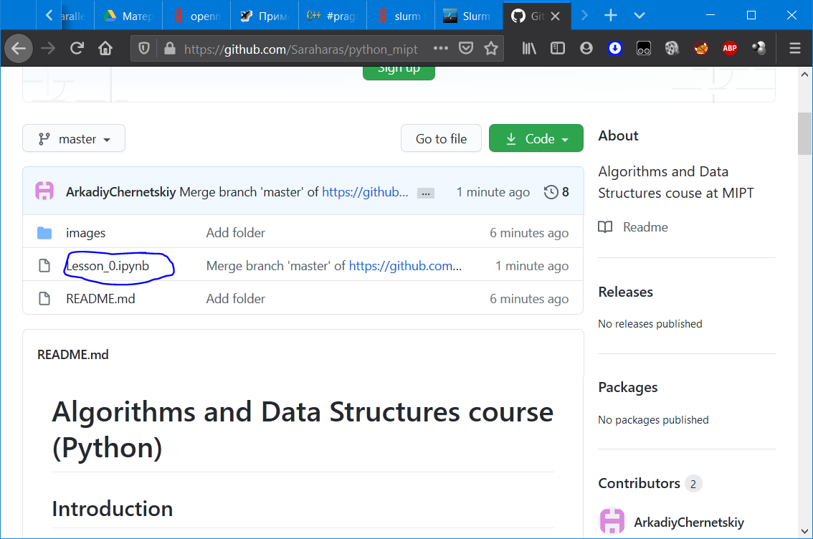

# Algorithms and Data Structures course (Python)

## Lectures

The course include several lectures-seminars. In them you will see some theory and examples of code.
They are named as `month-day Theme.ipynb`. Pay attention, they have `ipynb` file extension what mean exactly `IPhython notebook`.

GitHub can correctly open and display them, so just click, read, copy and run them. (And copy you will be really often))

## Homework and credit

During the course you should make some home tasks in Rosalind and in file named Homework. Inside the file you will find deadlines - this is the time until which you should make a certain part of homework.

For homework tasks you should create a folder inside google drive and send a link to it. After that you can send there your ipynb files for check.

For the tasks solving you will get the points (each task cost some points, not a hole homework for some day). They will be write at the table and at the end of the course they will be counted. In accordance with the points received, you will receive a grade.
 
### A Few Tasks (Rosalind)

After you understand everything (or at least something) you may want to test yourself. For this we use `Rosalind` site with number of tasks about dna data processing. To enter it go to this [link](http://rosalind.info/classes/enroll/5b7fa76f90/) and sign up there. Then you should enter this link again and enroll into class to rate you work in the semester.

Into the class you can see list of the tasks, that you can solve. The more tasks you solve the better). That's it. Let's go to work!