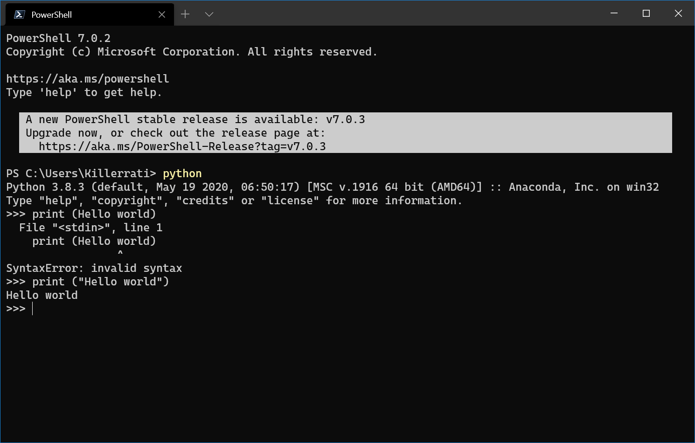
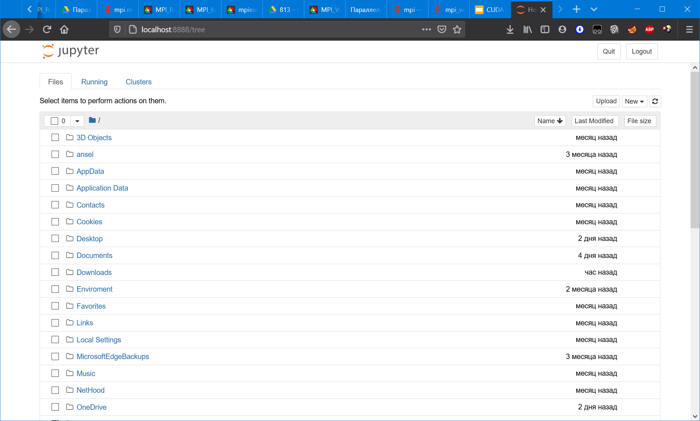
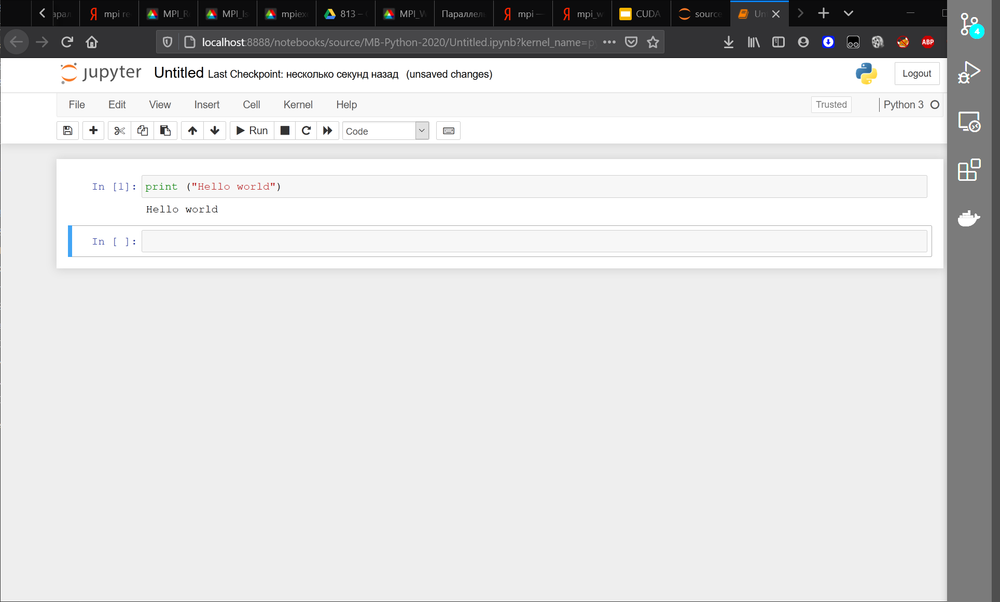

# Algorithms and Data Structures course (Python)
## Introduction
Hello, dear reader. In this course you learn (If you want, of course) some simple algorithm together with basics of Python.

First of all - what is that - programming. In simple sometimes it's a monolog of programmer with computer, but more often it's a dialog. Programmer should explain to computer what it should do. And quite often computer (actually compiler) answer, that it impossible or there is some strange sings. Or, what happen very often, it just work not as expected.

So, what exactly are computer and programmer talking about? The answer is algorithm. Programmer tell computer what exactly it should do, and computer do it. It not know what should be in the result, and it actually not know anything about correct and incorrect work, so don't be mad at it).

In other hand, algorithm is not exactly what you tell to computer. It's abstraction, that describe a logic, that must be done. But there can be others difficulties like work with memory, optimizations and others. It depends from language that you use.

Above you see example of simple algorithm written for GCD calculation. But what more important - it consist of blocks, each one have something like command to computer. One by one it perform and calculate them till the end, or till user not stop calculation (for example when computer froze). Programmes on some language just made from such simple blocks (actually they contains a lot of command for operation system and other components) and differences between different language is only in complication of them. For example in C++ to change variable in function you need pass it reference, but in Python it's enough to pass the variable itself. 

`int function (int& a);` - c++

`def function (a)` - python

How you can see above, in Python also you doesn't need to specify types, because Python try to calculate them by itself. So, I think you already understand what language we will learn (Python). Now let's go directly to it.

## Python
(From wiki) Python is an interpreted, high-level and general-purpose programming language. Created by Guido van Rossum and first released in 1991. It was created for the purpose of simplify programmer experience. It has garbage collector, that search a memory that you no longer use and free it (mean say for operation system, that it can use it for other tasks). As I said before, it dynamically typed mean you not need think about what type should be a variable or container, just think about it like the object that intuitively do what you expect from it.

And this language one of the best to learn algorithm and understanding the programming idea itself without thinking about hardware and resources problem. But be careful, if you want to learn some lower level language, it's better to begin from them, because it difficult to going down to lower levels than going up.

`print ("Hello world!")` - this code just print on your console window "Hello world!". Simple, doesn't it? But before you can try we should install special IDE (Integrated Development Environment), or simple the editor, that helps you right code.

Generally, there is enough to install interpreter, and then run it in console.

And I know that real true progammers writes codes in notepad and console, but it still more comfortable to use special editor. Some of them can give hints, other (like Jupyter) show work result in a comfortable way. So, for our course we will use Jupyter, because it most common IDE and it will be good if you learn how to use IPhython notebooks, that many people use as results presentation tool.

## Installing Jupyter

1. If you use Linux or Mac, just skip this step. If you Windows user than firstly you should install Python itself. For this go to https://www.python.org/downloads/ (or search in Google Python install) and download it. Not foget check the box with "add to PATH". After the installation run `cmd` in start menu. And then write 'python' command. If it's run correct (with version and other), then all is good.

2. In cmd (without running python) or terminal run command  `pip install jupyterlab` and wait till it install successfully. After the installation, let's try to run it with command - `jupyter notebook`. 

There you should see your home folder.
3. From new menu (at right) you can create folder for workspace, and then enter in it and create notebook. Then enter in it too.

On screen you see a notebook itself - it's a blocks of some codes, than can work independently or be execute one by one. Right in first block code, that we see before `print ("Hello world!")`. Than run it (like play button on the top pannel) and you will see "Hello world!" below, which means that code was ran and computer computer executed one command algorithm.

So, now you can try something else, something more complicated to see how it work, something more interesting and may be even "alive"). Because now there is gate of programming world in front of you. Dare!
